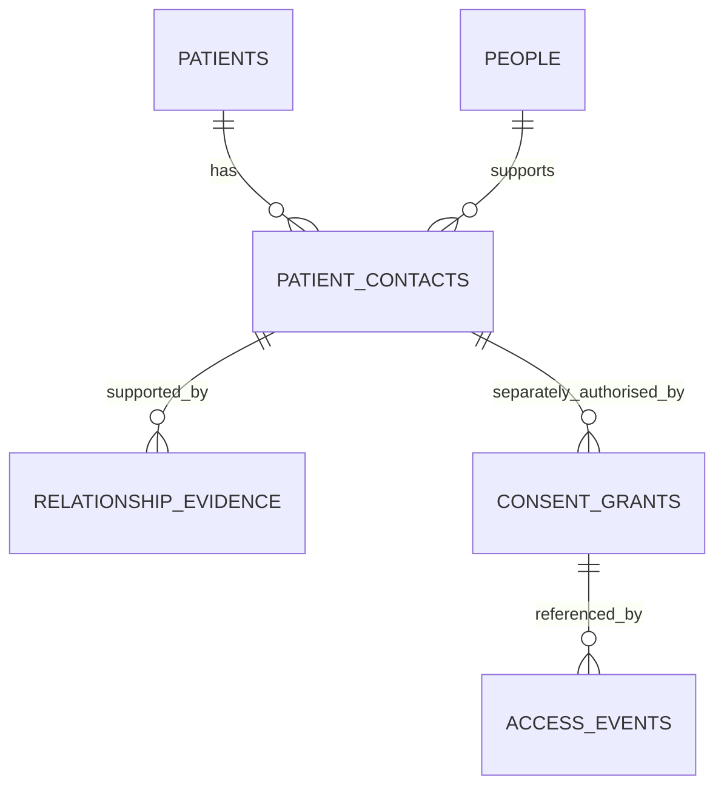

# Patient population and family relationships

Queried on 12 September 2026 using the existing key for world `team-8942268fa18a`. All requests were reads. The machine-readable results and query timestamps are in [family-audit.json](family-audit.json).

**Follow-up:** the [full 50,000-patient address audit](address-family-matching.md) confirms no postcodes, only 180 repeating addresses, and no populated structured contact/link fields. The figures below describe the earlier 300-record sample. Subsequent live GP reads also found a source-backed [unnamed daughter for Amira](amira-relationship-candidate.json).

## Findings

| Question | Result |
| --- | --- |
| How many patients are in our world? | **50,000**, confirmed by the GP directory and three PDS search responses |
| How many match “Carer involvement”? | **3,176** directory matches; this is a care-need search count, not a family count |
| Do demographic records identify relatives? | No structured family links found in the **300 records examined** |
| Can we identify households by address? | Not reliably: **160 distinct addresses across 300 records**; 240 records share their address with another sampled record |
| Do contacts help match relatives? | All 300 sampled records have distinct synthetic patient email addresses, with no shared contact values |
| Do clinical notes mention family? | Yes. Eleanor's previously captured notes mention her husband, but do not give his identity or contact details |

The demographic sample covers offsets 0, 24,900 and 49,900, with 100 records per page. It is a bounded, non-random structural check, not a full scan of 50,000 clinical records. We cannot report a verified number of families from this data.

## Exact queries

Base URL: `https://sim.animahealth.com`. Send the existing team key in the Authorization header.

```text
GET /api/team
GET /api/sites/gp/patients?offset=0
GET /api/sites/gp/patients?q=Carer%20involvement&offset=0
GET /api/nhs/pds/Patient?_count=100&_offset=0
GET /api/nhs/pds/Patient?_count=100&_offset=24900
GET /api/nhs/pds/Patient?_count=100&_offset=49900
```

The GP directory reports `total`; PDS returns `Bundle.total`. Each PDS result supplied names, birth date, identifiers, address, patient telecom, registered GP and synthetic metadata. None of the 300 supplied `Patient.contact` or `Patient.link`. A Patient link, if present later, would still need its meaning checked; it is not automatically a family relationship.

The published schema has no family-member/RelatedPerson endpoint or patient–relative mapping. The PDS query parameter named `family` means **surname prefix**, not a family group. [PDS guide](https://sim.animahealth.com/docs/fhir/), [captured API contract](simulator-openapi.json).

Fresh GP clinical-record requests repeatedly timed out during this audit. The family-note example below comes from the successful earlier capture, not a claimed fresh read. The demographic and count requests above succeeded live.

## Why matching demographic fields is insufficient

The simulator documents addresses and contacts as fictional fixtures. A shared surname or address can nominate a possible match, but neither establishes a relationship or permission to share health information. [Data guide](https://sim.animahealth.com/docs/data/), [demographic fixtures](https://sim.animahealth.com/docs/fhir/).

For example, the sample gives both of these patients `42 Cedar Crescent, Northbank`:

- `SIM-049901`, Evelyn S. Roberts, born 6 August 1995.
- `SIM-000041`, Eleanor Taylor, born 6 April 2015.

There is no relationship evidence tying them together. These could be generator collisions; we cannot conclude that they are parent and child. Likewise, Eleanor Chen and Thomas Chen share a surname but have different recorded addresses, and no observed record identifies Thomas as Eleanor's husband.

Each sampled email is generated from the patient ID, such as `sim-000006@patients.example`. It identifies a fixture, not a reachable or verified family member.

## Enrichment that is useful

Eleanor Chen, `SIM-000006`, has two relevant captured records:

| Source record | Evidence | What it supports |
| --- | --- | --- |
| `r-3689`, `data.context` | “Lives with her husband…” and uses a landline rather than the patient app | A husband is mentioned; telephone interaction may suit this patient |
| `r-3692`, `data.text` | Her husband could not drive her to a review | A transport-support issue; no relative identity or authority is established |

We can extract a **candidate relationship**: patient `SIM-000006`, relationship `spouse`, description `husband mentioned in GP notes`, identity unknown, confirmation pending. Keep source record IDs, versions, field paths and the exact relevant excerpts.

Do not create an authenticated family account from this mention, guess the husband's name, or link him to another patient by surname. Also distinguish active carers from family-history statements such as a parent's past illness.

There are two sensible enrichment paths:

1. **Patient-confirmed:** the patient identifies someone, supplies contact details, confirms the relationship, and separately chooses sharing permissions. The invitee verifies their own account/contact. For a staff-assisted or representative flow, record who confirmed the relationship and the basis; a staff annotation alone must not silently grant access.
2. **Synthetic demo:** create clearly marked fictional family contacts in our database for chosen demo patients. Any invented name, contact or relationship is `synthetic_demo`, never presented as extracted EHR fact. Keep it separate from the clinical record. Demo role-playing must also be explicit.

Do not use public-web searches to fill in these fictional people's relatives.

## Recommended separate database

Use a patient–person link table. Each patient has one-to-many contacts, while the overall model is **many-to-many**: one daughter may support both parents, and one carer may support several patients. Family members do not need to be patients in the simulator.



Suggested tables, independent of a database provider:

| Table | Main fields | Purpose |
| --- | --- | --- |
| `patients` | `id`, `source_system`, `world_id`, `external_patient_id`, `display_name`, `last_synced_at` | Reference the simulator patient. Unique on source + world + external ID; avoid copying the full EHR initially |
| `people` | `id`, `display_name`, `auth_subject` nullable, contact details, contact verification timestamp, `is_demo` | A relative, friend or carer; account identity may be linked after invitation acceptance |
| `patient_contacts` | `id`, `patient_id`, `person_id`, `relationship_type`, `status`, `source_kind`, `confirmed_by`, `confirmed_at` | A patient's link to a known person. Unique on patient + person. States such as pending/confirmed/removed |
| `relationship_evidence` | `id`, `patient_contact_id` nullable, `patient_id`, `relationship_hint`, `source_record_id`, `source_version`, `source_field`, `excerpt`, `captured_at` | Source-backed candidates can exist before a person is identified; preserve what was observed |
| `consent_grants` | `id`, `patient_contact_id`, `category`, `allowed_fields`, `purpose`, `valid_from`, `expires_at`, `revoked_at`, `version`, `granted_by` | Explicit sharing rules. A confirmed relationship does not create a grant |
| `access_events` | `id`, `patient_id`, `actor_id`, `recipient_id`, `consent_grant_id` nullable, `consent_version`, `action`, `decision`, `reason`, `source_records`, `occurred_at` | Allowed and denied reads/notifications, including decisions where no grant exists |

Evidence can be unlinked while identity is unknown. Access events can have no matching grant for a denied request; the diagram shows only the optional relationship when a grant is referenced. An authentication system and a verified mapping of patient accounts to patient records are also needed; the simulator key does not provide individual identity.

Store more than just `patient_id` on imported references: simulator IDs can repeat in another world. If a relative also happens to be a patient, link the same authenticated person through a verified identity mapping; do not merge records on name alone.

## How this becomes agent tools

| Proposed tool | Behaviour |
| --- | --- |
| `get_support_network(patient_id)` | Read known contacts and their relationship status, subject to caller access |
| `suggest_relationships_from_records(patient_id)` | Extract sourced, unverified candidates; never grant access |
| `prepare_family_invitation(patient_id, person_id)` | Prepare an invitation for review/authorised sending; sending is a separate action |
| `confirm_patient_contact(contact_id)` | Record confirmation by an authorised actor with supporting evidence |
| `grant_sharing(contact_id, category, fields, purpose, expiry)` | Persist an explicit decision from a verified patient or authorised representative |
| `get_family_patient_view(patient_id)` | Derive the family identity from login; return only currently permitted fields |
| `revoke_sharing(grant_id)` | Revoke in our application and stop future reads/notifications through our service |

The model can propose relationships and explain decisions. The backend checks identity, relationship status and current grants in code. Apply the same checks to our UI APIs, ADK tools and future MCP tools. Revocation cannot erase information already delivered or change access through the original simulator.

**Recommendation:** use the separate database as the source of truth for relationships and consent. Use simulator data to suggest candidates and supply source evidence. For the first demo, add clearly marked synthetic relatives to Eleanor's record in our own layer; later replace demo confirmation with real invitation and patient-confirmation flows. No relationships, accounts or consent grants were created during this investigation.
